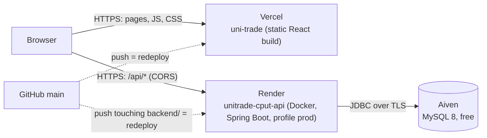

# Deployment (free tiers)

The marker runs the app locally (see README). The deployment is for the demo video and so problems surface early.
Written so someone new can take over **without access to the hosting dashboards**.

## 1. Current state

| Part | Host | Status | Address |
|---|---|---|---|
| Frontend (React build) | **Vercel**, project `uni-trade` (Collins's account) | Live, redeploys on every push to `main` | https://uni-trade-eight.vercel.app |
| Backend (Spring Boot) | **Render**, web service `unitrade-cput-api` (Docker, free; Collins's account) | Being created (2026-10-08); update this row when live | https://unitrade-cput-api.onrender.com |
| Database (MySQL 8) | **Aiven**, free MySQL `unitrade-db` (Collins's account) | Being created (2026-10-08) | (secret, only in Render) |



## 2. Configuration rule: set once in dashboards, everything else in git

| Setting | Where it lives | How to change it |
|---|---|---|
| `DB_URL`, `DB_USERNAME`, `DB_PASSWORD`, `JWT_SECRET` (secrets) | Render → service → Environment, **set once** at creation | Only if the database or secret is replaced (Collins) |
| `SPRING_PROFILES_ACTIVE=prod` | Render → Environment, set once | Never |
| Everything else for the deployed API (allowed frontend address, pool size, future settings) | [`backend/src/main/resources/application-prod.properties`](../backend/src/main/resources/application-prod.properties) — **in git** | Edit and push → Render redeploys |
| Address of the API used by the website | [`frontend/.env.production`](../frontend/.env.production) — **in git** | Edit and push → Vercel redeploys |
| Vercel dashboard settings | Root Directory `frontend`, preset Vite (no environment variables needed) | Never |

So future slices never need dashboard access: new non-secret settings go in `application-prod.properties` (with safe defaults in `application.properties` for local runs). Only add a new *secret* if unavoidable — it needs Collins (or a token, section 7).
If a secret is missing, the API refuses to start and its log says exactly which one (tested: `nfr1_02`).

## 3. Free-tier facts that affect the demo (checked 2026-10-08)
- **Render free web service:** 0.1 CPU, 512 MB RAM; **sleeps after 15 minutes without traffic**; 750 free hours per month; no card needed. ([render.com/docs/free](https://render.com/docs/free))
- **Measured cold start:** the same container limited to 0.1 CPU / 512 MB on the dev PC took **93 s** until `/api/health` answered (167 s before the JVM flag in `backend/Dockerfile`), using ~135 MB RAM. Expect **1.5–3 minutes** for the first request after the API slept; the site shows "the server may be waking up…" after 6 s.
- **Before recording the demo:** open the site (or run the check in section 5) ~3 minutes before.
- **Aiven free MySQL:** 1 CPU, 1 GB RAM, 1 GB storage, no card, no expiry; may be **powered off if unused for a while** (email first; power it on in the Aiven console). Every table must have a **primary key** (`sql_require_primary_key` is on). ([free plan](https://aiven.io/docs/platform/concepts/free-plan), [primary keys](https://aiven.io/docs/products/mysql/howto/create-tables-without-primary-keys))
- Redis is not used in deployment.

## 4. Build it from nothing
Order: **A** Render account → **B** Aiven database → **C** Render service (needs B's values) → check (section 5).
Vercel needs nothing more: `frontend/.env.production` already points at `https://unitrade-cput-api.onrender.com`.

### 4.A Render account and GitHub access (~3 min)
1. https://render.com → **Get Started** → **GitHub** → sign in as the repo owner (`shibambocollins`).
2. Give Render access to the repo: accept the GitHub prompt (**Only select repositories** → `UniTrade`), or later via https://github.com/apps/render/installations/new.
3. No card needed. Stop here until the database exists.

### 4.B Database — Aiven (~5 min)
1. https://aiven.io → **Get started for free** → sign up (GitHub works). Name the organization/project `unitrade` if asked.
2. **Create service** → **MySQL** → plan **Free** → a European region if offered (Render runs in Frankfurt), otherwise any → service name `unitrade-db` → **Create free service**.
3. Wait for **Running**. Open the service → **Overview → Connection information**: note **Host**, **Port**, **User** (`avnadmin`), **Password**, **Database name** (`defaultdb`).
4. Keep the IP allow-list at its default (open); Render's free outbound addresses are not fixed.

### 4.C API service — Render (~10 min, mostly waiting)
**New → Web Service**, then every field:

| Field | Value |
|---|---|
| Source Code | Git Provider → `shibambocollins/UniTrade` |
| Name | `unitrade-cput-api` (this gives https://unitrade-cput-api.onrender.com; if Render shows a different address, put that address in `frontend/.env.production` and push) |
| Project | leave empty |
| Language | **Docker** |
| Branch | `main` |
| Region | **Frankfurt (EU Central)** |
| Root Directory | `backend` |
| Instance Type | **Free** |

**Environment Variables** (+ Add Environment Variable), five in total:

| Key | Value |
|---|---|
| `SPRING_PROFILES_ACTIVE` | `prod` |
| `DB_URL` | `jdbc:mysql://HOST:PORT/defaultdb?sslMode=REQUIRED&serverTimezone=UTC` (Host and Port from 4.B) |
| `DB_USERNAME` | `avnadmin` |
| `DB_PASSWORD` | the Aiven password |
| `JWT_SECRET` | a random value: in PowerShell run the line below, then paste (Ctrl+V). It is copied to the clipboard and never shown. |

```powershell
$b = New-Object byte[] 32; [Security.Cryptography.RandomNumberGenerator]::Create().GetBytes($b); [Convert]::ToBase64String($b) | Set-Clipboard
```

**Advanced:**

| Field | Value |
|---|---|
| Health Check Path | `/api/health` |
| Dockerfile Path | `./Dockerfile` (shown after a `backend/` prefix; if there is no prefix, `backend/Dockerfile`) |
| Docker Build Context Directory | `.` (after the `backend/` prefix; if there is no prefix, `backend`) |
| Auto-Deploy | **On Commit** |
| Docker Command, Pre-Deploy Command, Secret Files, Disk, Registry Credential, Build Filters | leave empty |

**Deploy Web Service** → open **Logs**: build ~5 min, then `Started UnitradeApplication` (~1.5 min) and "Your service is live". Open https://unitrade-cput-api.onrender.com/api/health → `{"status":"UP","database":"UP",...}`.

*Alternative:* **New → Blueprint** → **Connect** `UniTrade` → name `unitrade`, branch `main` → fill `DB_URL`, `DB_USERNAME`, `DB_PASSWORD` (`JWT_SECRET` is generated automatically) → **Deploy Blueprint**. [`render.yaml`](../render.yaml) holds the same settings as the table above.

## 5. Check a deployment
```
node scripts/check-deploy.mjs --web https://uni-trade-eight.vercel.app --api https://unitrade-cput-api.onrender.com
```
Checks API + database health, that the site and deep links load, that the website build points at the API, and that CORS allows the site and refuses others. Every failure prints what to fix. Anyone can run it; no account needed.
Verified on 2026-10-08 against a local copy of the same setup: all 6 checks passed; a wrong API address was reported as a failure. Production mode (`prod` profile, secrets from environment variables only) was also started against a real MySQL: database UP, Vercel origin allowed, `localhost` refused.

## 6. Day-to-day (no dashboard access needed)
- `git push` to `main` → Vercel redeploys; Render redeploys when files under `backend/` change.
- Before pushing backend changes: tests pass (`.\mvnw.cmd test`), and optionally the container starts with Render's limits:
  `cd backend; docker build -t unitrade-api:local .` then
  `docker run --rm -p 8081:8080 -m 512m --cpus 0.1 -e SPRING_PROFILES_ACTIVE=h2 unitrade-api:local` → http://localhost:8081/api/health
- After pushing: CI status on GitHub (Actions tab), then `scripts/check-deploy.mjs` (section 5) once Render has redeployed (~7 min).

## 7. If someone else needs to see logs or change a secret
The accounts belong to Collins. Without sharing passwords, he can give the next person **revocable tokens**, sent privately (never in git or a chat with Claude):
- **Render:** Account Settings → **API Keys** → Create. With it, Claude Code can read logs, change environment variables and trigger deploys through Render's API (no plugin needed).
- **Vercel:** Account Settings → **Tokens** → Create (scope: the `uni-trade` project's team). Usable with `npx vercel --token ...`.
- Store a token in a file outside the repo (e.g. `C:\Users\<you>\unitrade-deploy\render-key.txt`) and tell Claude the path, not the value.
Collins can delete the tokens after the project is handed in.

## 8. Troubleshooting
| Symptom | Likely cause | Fix |
|---|---|---|
| Page says "Still working… server may be waking up" for 1–3 min | Render free service was asleep | Wait; warm it up before demos |
| Page says "Cannot reach the UniTrade server" | API not deployed yet, failed deploy, or wrong address in `frontend/.env.production` | `check-deploy.mjs` shows which; fix the address by commit |
| Browser console: "blocked by CORS policy" | Site address not in `app.cors.allowed-origins` | Edit `application-prod.properties` and push |
| Render log: `missing environment variable(s) [...]` | A secret was not set | Add it in Render → Environment (section 4.C) |
| `/api/health` shows `"database":"DOWN"`, or log `Communications link failure` | Aiven service powered off, or wrong `DB_URL` | Power on in Aiven; `DB_URL` must include `sslMode=REQUIRED` |
| Render log: `Access denied for user` | Wrong `DB_USERNAME`/`DB_PASSWORD` | Copy them again from Aiven |
| Render log: `Unable to create or change a table without a primary key` | An entity/join table without a primary key (Aiven rule) | Add an `@Id` / use a `Set` for `@ManyToMany` |
| Render deploy fails during build | Backend doesn't compile or Dockerfile changed | Run the local `docker build` (section 6) to see the error |
