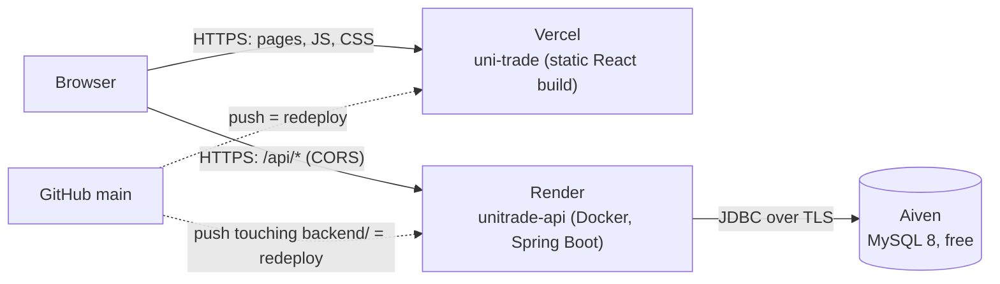

# Deployment (free tiers)

The marker runs the app locally (see README). The deployment is for the demo video and so problems surface early.
This page is written so someone new can take over: current state, how it fits together, how to rebuild it from nothing, and how to check it.

## 1. Current state

| Part | Host | Status (2026-10-08) | Address |
|---|---|---|---|
| Frontend (React build) | **Vercel**, project `uni-trade`, Root Directory `frontend`, preset Vite | Deployed from GitHub `main`; `VITE_API_URL` **not set yet** (backend not deployed) | https://uni-trade-eight.vercel.app |
| Backend (Spring Boot) | **Render**, web service `unitrade-api` (Docker, free) | Not created yet | — |
| Database (MySQL 8) | **Aiven**, free MySQL plan | Not created yet | — |

Accounts are owned by Collins (sign-in with GitHub `shibambocollins`). Ask him for access; never share passwords in chat or commit them.
Secrets live only in the hosts' environment-variable settings (Render, Vercel), never in git.



The browser talks to Vercel for the page and directly to Render for data. `VITE_API_URL` (baked into the frontend at build time) tells the page where the API is; `APP_CORS_ORIGINS` on Render tells the API which site may call it.

## 2. Free-tier facts that affect the demo (checked 2026-10-08)
- **Render free web service:** 0.1 CPU, 512 MB RAM; **sleeps after 15 minutes without traffic**; 750 free hours per month; no card needed. ([render.com/docs/free](https://render.com/docs/free))
- **Measured cold start:** the same container limited to 0.1 CPU / 512 MB on the dev PC took **93 s** until `/api/health` answered (167 s before the JVM flag in `backend/Dockerfile`), using ~135 MB RAM. Expect roughly **1.5–3 minutes** for the first request after the API has slept. The app shows "the server may be waking up…" after 6 s.
- **Before recording the demo:** open the site (or run the check in section 4) about 3 minutes before, so the API is awake.
- **Aiven free MySQL:** 1 CPU, 1 GB RAM, 1 GB storage, no card, no expiry; may be **powered off if unused for a while** (email warning first; power it back on in the Aiven console). ([Aiven free plan](https://aiven.io/docs/platform/concepts/free-plan), [MySQL free tier](https://aiven.io/docs/products/mysql/concepts/mysql-free-tier))
- Redis is not used in deployment; the app runs without it.

## 3. Build it from nothing (in this order; each step needs a value from the one before)

### 3.1 Database — Aiven
1. aiven.io → sign in with GitHub → **Create service** → **MySQL** → **Free plan** → a European region if offered (close to Render Frankfurt) → create.
2. When it is *Running*, open **Overview → Connection information** and note Host, Port, User (`avnadmin`), Password, Database (`defaultdb`).
3. JDBC URL for the API: `jdbc:mysql://HOST:PORT/defaultdb?sslMode=REQUIRED&serverTimezone=UTC`

### 3.2 API — Render (Blueprint, recommended)
The service is described in [`render.yaml`](../render.yaml) at the repo root.
1. render.com → sign in with GitHub → allow access to the `UniTrade` repo.
2. **New → Blueprint** → pick the repo → Render reads `render.yaml` and asks for the secret values:
   `DB_URL` (from 3.1), `DB_USERNAME` = `avnadmin`, `DB_PASSWORD` = Aiven password.
3. Apply. The first build takes ~5 minutes, then start-up ~1.5 minutes. Note the address, e.g. `https://unitrade-api.onrender.com` (Render may add a suffix if the name is taken).
4. Open `<render address>/api/health` → `{"status":"UP","database":"UP",...}`.

*Manual alternative:* New → Web Service → repo → Language **Docker**, Root Directory `backend`, Instance **Free**, Region Frankfurt, Health Check Path `/api/health`, and the four environment variables from `render.yaml`.

### 3.3 Frontend — Vercel
1. vercel.com → **Add New → Project** → import `UniTrade` → **Root Directory `frontend`** (preset Vite is detected).
2. **Settings → Environment Variables:** `VITE_API_URL` = the Render address from 3.2 (no trailing slash), for Production.
3. **Redeploy** (Deployments → ⋯ → Redeploy). `VITE_API_URL` is read at build time, so changing it always needs a redeploy.

### 3.4 Let the site call the API (CORS)
`render.yaml` already sets `APP_CORS_ORIGINS=https://uni-trade-eight.vercel.app`. If the Vercel address is different (new project or custom domain), change it in Render → service → **Environment** (comma-separated for several addresses, no trailing slash) and save; Render redeploys.

## 4. Check a deployment
```
node scripts/check-deploy.mjs --web https://uni-trade-eight.vercel.app --api https://<render address>
```
It checks API + database health, that the site and deep links load, that the frontend build points at the API, and that CORS allows the site and refuses others. Every failure prints what to fix. Verified on 2026-10-08 against a local copy of the same setup (container with Render's limits + production frontend build on another port): all 6 checks passed, and a wrong API address was reported as a failure.

## 5. Day-to-day
- `git push` to `main` redeploys Vercel; Render redeploys when files under `backend/` change.
- Logs: Render → service → **Logs**; Vercel → **Deployments** → a deployment → **Build Logs**; browser console (F12) for CORS errors.
- Test the container locally before pushing backend changes: `cd backend; docker build -t unitrade-api:local .` then
  `docker run --rm -p 8081:8080 -m 512m --cpus 0.1 -e SPRING_PROFILES_ACTIVE=h2 unitrade-api:local` and open http://localhost:8081/api/health.

## 6. Troubleshooting
| Symptom | Likely cause | Fix |
|---|---|---|
| Page says "Still working… server may be waking up" for 1–3 min | Render free service was asleep | Wait; warm it up before demos |
| Page says "unexpected response from the server" | `VITE_API_URL` missing or wrong in Vercel | Set it (section 3.3) and **redeploy** |
| Browser console: "blocked by CORS policy" | `APP_CORS_ORIGINS` doesn't exactly match the site address | Fix it in Render (section 3.4) |
| `/api/health` shows `"database":"DOWN"` or Render logs show `Communications link failure` | Aiven service powered off, or wrong `DB_URL` | Power on in Aiven; check `DB_URL` includes `sslMode=REQUIRED` |
| Render logs show `Access denied for user` | Wrong `DB_USERNAME`/`DB_PASSWORD` | Copy them again from Aiven |
| Render deploy fails during build | Backend doesn't compile or the Dockerfile changed | Run the local `docker build` from section 5 to see the error |
