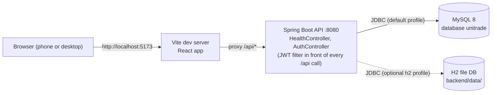
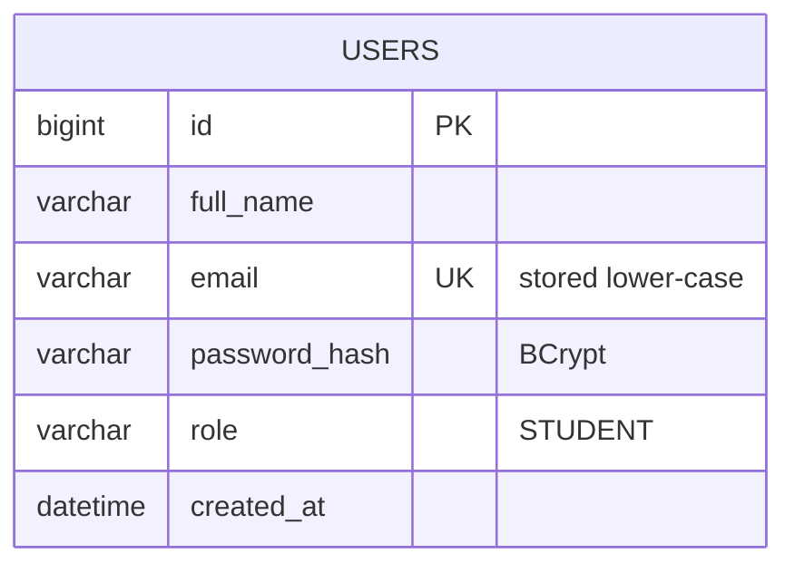
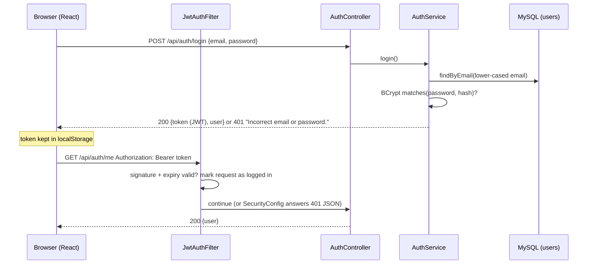

# UniTrade — Evidence File

> Single source of evidence for the PRM372S portfolio (Final Report, Quality Plan, Risk Plan, Transition & Closure Plan, Reflection, Resource Plan) and for the video demo.
> **Rules:** (1) Only record things that really happened. (2) Test results come from real test runs: `node scripts/test-report.mjs` (automated) or are entered by Collins after he executes them (manual). (3) Anything not yet done is marked `NOT RUN` / `NOT BUILT`, never filled in.
> Sections 2 and 3 contain machine-written blocks between `<!-- ...:START -->` and `<!-- ...:END -->` markers. **Do not edit inside those markers by hand.**

**Project:** Community Store Mobile-First Marketplace (UniTrade) · **Course:** PRM372S · **Student:** Collins (230093183)
**Scope decision:** Student-only marketplace (see Decision Log D1).

---

## 1. Requirements traceability and success-criteria scorecard
Maintained by Claude Code at the end of every slice. `Status` is one of: NOT BUILT · IN PROGRESS · BUILT · BUILT + TESTED. Test status is taken from Section 2, not assumed.

| ID | Requirement (short) | Priority tier | Slice | Status | Evidence (tests / manual test IDs / screenshots) | Met? (Yes / Partly / No / Not yet assessed) |
|---|---|---|---|---|---|---|
| FR1 | Student registration/login, `@mycput.ac.za` only, hashed passwords, JWT | Tier 1 | 1 | BUILT + TESTED | Automated: backend `Fr1AuthTest` (11: non-student and look-alike domains rejected, BCrypt hash stored, duplicate email 409, short password, wrong password and unknown email give the same 401, protected endpoint 401 without / garbage / forged / expired token, JSON error bodies), `Fr1EmailPolicyTest` (2); frontend `Fr1Auth.test.jsx` (9). Checked by hand against MySQL on 2026-10-08 with curl (see slice log). Manual UI tests M1-01…M1-05 are `NOT RUN`. | Partly (manual UI tests not run yet) |
| FR2 | Create/edit/delete listings (goods and services), owner-only | Tier 1 | 2 | NOT BUILT | | Not yet assessed |
| FR3 | Search + filter (keyword, category, price range, condition) | Tier 1 | 3 | NOT BUILT | | Not yet assessed |
| FR4 | Cart, checkout, payment via mock gateway, order lifecycle | Tier 1 | 4 | NOT BUILT | | Not yet assessed |
| FR6 | Ratings and reviews after a completed order | Tier 1 | 5 | NOT BUILT | | Not yet assessed |
| FR5 | Community bulletin board | Tier 2 | 6 | NOT BUILT | | Not yet assessed |
| NFR1 | Security (hashing, JWT, validation, no secrets in repo) | Tier 1 | all | IN PROGRESS | Slice 0: DB credentials only via env vars / git-ignored `application-local.properties`; CORS restricted to configured origins (manual curl check 2026-10-08: unlisted origin 403). Production profile: automated `nfr1_01` (only the deployed site allowed), `nfr1_02` (missing secrets named, start refused). Slice 1: BCrypt hashes (`$2a$10$…` seen in MySQL), JWT-protected endpoints (401 JSON without a valid token, tests `fr1_09`/`fr1_10`), password hash never returned by the API, JPA only (no hand-written SQL), CSRF off by design for a stateless token API (D14). | Not yet assessed |
| NFR2a | Redis caching of search | Tier 2 | 7 | NOT BUILT | | Not yet assessed |
| NFR2b | Search p95 < 2 s under load (see Section 3) | Tier 2 | 7 | NOT BUILT | | Not yet assessed |
| NFR2c | Microservices architecture | Tier 3 (stretch) | 8 | NOT BUILT | | Not yet assessed |
| NFR3 | Mobile-first responsive UI | Tier 1 | all | IN PROGRESS | Slice 0: mobile-first stylesheet (44 px touch targets), shared loading/empty/error views; automated `slice0_02` (friendly error instead of blank screen), `slice0_03` (not-found page) | Not yet assessed |

**Success criteria (used in the Transition & Closure Plan):**
1. All Tier 1 requirements are BUILT + TESTED and their automated tests pass.
2. Zero open critical defects in Section 8 at submission.
3. Search p95 < 2000 ms with zero errors at 50 concurrent users on the performance dataset.
4. The full demo flow (Section 10) runs end to end without errors on a clean machine using the README steps.

| Criterion | Result | Evidence |
|---|---|---|
| 1 | Not yet assessed | |
| 2 | Not yet assessed | |
| 3 | Not yet assessed | |
| 4 | Not yet assessed | |

---

## 2. Test report
### 2.1 Automated tests (JUnit / Vitest)
Generated by `node scripts/test-report.mjs` from real result files. Naming convention: put the requirement ID in the test name, e.g. `fr1_01_registerRejectsNonStudentEmail`, so results can be grouped by requirement.

<!-- TEST-REPORT:START -->
**Generated:** 2026-10-08 21:24:39 UTC · **Machine:** win32 10.0.26200 · **Node:** v24.15.0

**Result files read:** 5 (backend/target/surefire-reports, frontend/test-results)

| Total tests | Passed | Failed | Skipped | Pass rate | Total time |
|---|---|---|---|---|---|
| 30 | 30 | 0 | 0 | 100.0% | 7.76 s |

### Results by requirement

| Requirement | Tests | Passed | Failed | Skipped |
|---|---|---|---|---|
| FR1 | 22 | 22 | 0 | 0 |
| NFR1 | 2 | 2 | 0 | 0 |
| NFR3 | 1 | 1 | 0 | 0 |
| Unmapped (no FR/NFR id in name) | 5 | 5 | 0 | 0 |

### All automated test cases

| Req | Test | Class | Result | Time (s) |
|---|---|---|---|---|
| — | Slice 0 - app shell > slice0_01 shows the API and database status from /api/health | src/App.test.jsx | PASS | 0.218 |
| — | Slice 0 - app shell > slice0_02 shows a friendly error (not a blank screen) when the server is unreachable | src/App.test.jsx | PASS | 0.046 |
| — | Slice 0 - app shell > slice0_03 shows a not-found page for unknown routes | src/App.test.jsx | PASS | 0.016 |
| — | Slice 0 - app shell > slice0_04 shows an error instead of loading forever when the answer is not from the API (HTML page) | src/App.test.jsx | PASS | 0.029 |
| — | slice0_01_healthEndpointReportsApiAndDatabaseUp | Slice0HealthTest | PASS | 0.026 |
| FR1 | FR1 - authentication screens > fr1_01 register shows the server message under the email field for a non-student email | src/auth/Fr1Auth.test.jsx | PASS | 0.876 |
| FR1 | FR1 - authentication screens > fr1_02 register with valid details logs the student in and keeps the token | src/auth/Fr1Auth.test.jsx | PASS | 0.702 |
| FR1 | FR1 - authentication screens > fr1_03 register checks the password length in the browser without calling the server | src/auth/Fr1Auth.test.jsx | PASS | 0.630 |
| FR1 | FR1 - authentication screens > fr1_04 login shows a friendly message for a wrong password and stays on the page | src/auth/Fr1Auth.test.jsx | PASS | 0.580 |
| FR1 | FR1 - authentication screens > fr1_05 login shows an error instead of a blank screen when the server is unreachable | src/auth/Fr1Auth.test.jsx | PASS | 0.613 |
| FR1 | FR1 - authentication screens > fr1_06 a protected page sends a logged-out visitor to login, then returns them after login | src/auth/Fr1Auth.test.jsx | PASS | 0.582 |
| FR1 | FR1 - authentication screens > fr1_07 a stored token that the server rejects (401) is discarded and the visitor is logged out | src/auth/Fr1Auth.test.jsx | PASS | 0.019 |
| FR1 | FR1 - authentication screens > fr1_08 a valid stored token restores the session after a refresh, and Log out clears it | src/auth/Fr1Auth.test.jsx | PASS | 0.071 |
| FR1 | FR1 - authentication screens > fr1_09 the password can be shown and hidden | src/auth/Fr1Auth.test.jsx | PASS | 0.070 |
| FR1 | fr1_01_registerRejectsNonStudentEmail | Fr1AuthTest | PASS | 0.034 |
| FR1 | fr1_02_registerRejectsLookalikeDomain | Fr1AuthTest | PASS | 0.026 |
| FR1 | fr1_03_registerStoresBcryptHashNormalisedEmailAndReturnsToken | Fr1AuthTest | PASS | 0.110 |
| FR1 | fr1_04_registerRejectsShortPassword | Fr1AuthTest | PASS | 0.421 |
| FR1 | fr1_05_registerRejectsMissingFields | Fr1AuthTest | PASS | 0.017 |
| FR1 | fr1_06_registerRejectsDuplicateEmailIgnoringCase | Fr1AuthTest | PASS | 0.193 |
| FR1 | fr1_07_loginReturnsJwtThatUnlocksProtectedEndpoint | Fr1AuthTest | PASS | 1.810 |
| FR1 | fr1_08_loginRejectsWrongPasswordAndUnknownEmailWithTheSameMessage | Fr1AuthTest | PASS | 0.196 |
| FR1 | fr1_09_protectedEndpointWithoutTokenIs401WithJsonBody | Fr1AuthTest | PASS | 0.010 |
| FR1 | fr1_10_protectedEndpointRejectsGarbageForgedAndExpiredTokens | Fr1AuthTest | PASS | 0.119 |
| FR1 | fr1_11_malformedJsonAndUnknownUrlGiveJsonErrorsNotHtmlOrStackTraces | Fr1AuthTest | PASS | 0.127 |
| FR1 | fr1_12_acceptsStudentAddressesIgnoringCaseAndSpaces | Fr1EmailPolicyTest | PASS | 0.000 |
| FR1 | fr1_13_rejectsEverythingElse | Fr1EmailPolicyTest | PASS | 0.009 |
| NFR1 | nfr1_01_prodProfileAllowsTheDeployedSiteOnly | Nfr1ProdConfigTest | PASS | 0.039 |
| NFR1 | nfr1_02_productionStartNamesMissingSecrets | Nfr1ProdConfigTest | PASS | 0.015 |
| NFR3 | NFR3 - loading state > nfr3_01 loading view explains a slow (waking) server instead of only spinning | src/components/StatusViews.test.jsx | PASS | 0.153 |

<!-- TEST-REPORT:END -->

### 2.2 Run history (shows how quality improved over time)
<!-- TEST-HISTORY:START -->
| Run (UTC) | Total | Passed | Failed | Skipped |
|---|---|---|---|---|
| 2026-10-08 18:01:02 UTC | 4 | 4 | 0 | 0 |
| 2026-10-08 19:33:45 UTC | 6 | 6 | 0 | 0 |
| 2026-10-08 20:19:57 UTC | 8 | 8 | 0 | 0 |
| 2026-10-08 21:24:39 UTC | 30 | 30 | 0 | 0 |
<!-- TEST-HISTORY:END -->

### 2.3 Manual tests
Claude Code creates the rows when it builds a slice, with Result = `NOT RUN`. **Only Collins (or a real automated run) changes a result.** Record the actual outcome, date, and a screenshot filename from `docs/screenshots/`.

| ID | Req | Scenario / steps | Expected | Actual | Result | Date | Screenshot |
|---|---|---|---|---|---|---|---|
| M0-01 | Slice 0 | Start MySQL backend and frontend as in README sections 3a and 4; open http://localhost:5173 | Home page shows "API: UP · Database: UP" | | NOT RUN | | |
| M0-02 | NFR3 | With the frontend running, stop the backend and reload the home page | Friendly "Cannot reach the UniTrade server" message with a "Try again" button; no blank screen | | NOT RUN | | |
| M0-03 | NFR3 | Open the home page in the browser device toolbar at 360 px width | No horizontal scrolling; header and status card readable | | NOT RUN | | |
| M0-04 | NFR1 | After the API is deployed: open https://uni-trade-eight.vercel.app on a phone; run `node scripts/check-deploy.mjs` (see docs/DEPLOYMENT.md) | Home page shows "API: UP · Database: UP" over HTTPS; all 6 checks PASS | | NOT RUN | | |
| M1-01 | FR1 | Open /register; sign up with `someone@gmail.com` | Red message under the email field: must end in @mycput.ac.za; no account created | | NOT RUN | | |
| M1-02 | FR1 | Sign up with your own `@mycput.ac.za` email and an 8+ character password | Logged in automatically; header shows your first name and "Log out"; /profile shows your name and email | | NOT RUN | | |
| M1-03 | FR1 | Log out, then log in with a wrong password, then the right one | Wrong password: "Incorrect email or password."; right password: logged in | | NOT RUN | | |
| M1-04 | FR1 | Logged out, open http://localhost:5173/profile directly | Redirected to the login page; after logging in you land on /profile | | NOT RUN | | |
| M1-05 | NFR3 | Register and login pages at 360 px width (device toolbar) | No horizontal scrolling; fields and buttons large enough to tap; Show/Hide password works | | NOT RUN | | |

---

## 3. Performance evidence (NFR2)
**Definition used (our own, because the charter does not define "peak campus hours"):** p95 response time of `GET /api/listings` (varied keyword/filter queries) below 2000 ms with 50 concurrent users for 30 s, with zero errors, against a database holding ~10,000 listings.
Generated by `node scripts/perf-search.mjs --label "..." --dataset 10000`. Run it at least twice on the same data: once with the cache disabled and once with Redis enabled.

<!-- PERF:START -->
| Date (UTC) | Run | Listings in DB | Users | Measured (s) | Requests | Errors | Req/s | p50 ms | p95 ms | p99 ms | Max ms | Result |
|---|---|---|---|---|---|---|---|---|---|---|---|---|
<!-- PERF:END -->

**Test machine and conditions** (fill in when running: CPU, RAM, OS, MySQL version, Redis version, whether backend and DB ran on the same machine):
- _not recorded yet_

**Interpretation** (Claude Code writes this after real runs; no speculation): _not recorded yet_

---

## 4. Deviations and limitations (charter promised vs delivered)
Every difference between the submitted Term 1 charter / brief and the final app, with the reason. The Final Report's "scope and limitations" section is built from this.

| # | Charter / brief said | What was delivered | Reason | Impact on requirements |
|---|---|---|---|---|
| L1 | Target users: students, faculty, vendors, residents | Students only | FR1 requires a university email; limited time; keeps the trust model simple | FR5 poster roles reduced to students |
| L2 | FR1 domain written as `cput.ac.za` | `mycput.ac.za` | Student email addresses use `mycput.ac.za` | None |
| L3 | FR4 integrate PayFast or SnapScan | Mock payment gateway simulating the flow | Charter scope allowed "simulated or functional"; no paid/live credentials | FR4 met in simulated form only |
| L4 | Messaging and notifications in scope | Not built (unless a stretch item is recorded below) | Time | Not an FR |
| L5 | 2FA, escrow, AI fraud detection, pen-testing | Not built | Time | Risk R2 mitigation only partly implemented |
| L6 | FR1 "valid university email" (charter assumed CPUT IT would support verification) | Domain check on the email address only; no mailbox-ownership verification | No CPUT IT integration available; a verification-code email is out of the time budget | R1 (fraud) mitigation is weaker than the charter implied |
| L7 | NFR1 security | HTTPS only on the deployed site (Vercel/Render provide certificates); local runs use plain HTTP | Local TLS certificates add setup work for anyone running the app | NFR1 transport security holds only for the deployed version |
| L8 | Term 2 screen designs (`docs/screens/`): "Sign in with Google", "Forgot password?", Student/Vendor toggle, Vendor, Notifications and Chat screens | Email + password login only; no password reset; student accounts only; no notifications or chat | Outside the agreed requirements (FR1–FR6) and time budget; Google sign-in would bypass the `@mycput.ac.za` rule | A user who forgets their password cannot recover the account in the app |
| | _Add more as they occur_ | | | |

---

## 5. Architecture
Claude Code maintains these as Mermaid diagrams, matching the real code, not the plan.

### 5.1 Components and deployment (what actually runs)
State after Slice 0: what runs locally. Deployment (diagram in `docs/DEPLOYMENT.md`): the frontend is live on Vercel (https://uni-trade-eight.vercel.app, project `uni-trade`, set up by Collins on 2026-10-08); the API (Render) and database (Aiven) are not created yet. The Docker image builds and runs (verified locally 2026-10-08, including under Render's free limits).

Tests use a separate in-memory H2 database (`test` profile), so they need neither MySQL nor Redis.

### 5.2 Entity-relationship diagram
State after Slice 1 (only the `users` table exists; later slices add listings, orders, reviews, bulletin posts).

### 5.2a Authentication sequence (FR1)

### 5.3 Checkout sequence (cart → order → payment → completion)
_not recorded yet_

### 5.4 Technology stack (with exact versions from pom.xml / package.json)
Backend versions are the ones Maven resolved (`mvnw dependency:list`, 2026-10-08); frontend versions are pinned exactly in `package.json`.

| Layer | Technology | Version |
|---|---|---|
| Backend language | Java (compiled for 17; built and tested on JDK 21.0.9) | 17 |
| Backend framework | Spring Boot (Spring Web MVC 6.2.19, embedded Tomcat 10.1.55, Jackson 2.21.4) | 3.5.16 |
| Persistence | Spring Data JPA 3.5.13 / Hibernate ORM | 6.6.53.Final |
| Database (main) | MySQL Server / Connector/J | 8.0.44 / 9.7.0 |
| Database (tests, optional quick start) | H2 | 2.3.232 |
| Backend tests | JUnit Jupiter + Spring MockMvc | 5.12.2 |
| Build | Maven via wrapper (wrapper 3.3.4) | 3.9.9 |
| Frontend | React / React DOM | 19.3.0 |
| Routing | React Router | 7.18.4 |
| Build tool | Vite (+ @vitejs/plugin-react 5.2.0) | 7.3.7 |
| Frontend tests | Vitest + React Testing Library 16.3.3 + jsdom 26.1.0 | 4.1.11 |
| Styling | One global CSS file with CSS variables (no framework) | — |
| Runtime (dev) | Node.js / npm | 22.21.1 / 10.9.4 |

---

## 6. Slice log (what was built, and how to explain it)
One entry per slice, added when the slice is finished. Written in plain language so Collins can explain it in the presentation.

| Slice | Finished (git timestamp) | What it does | Key classes/files | Design choices and why | What could go wrong / how it is handled |
|---|---|---|---|---|---|
| 0 Scaffolding | _pending Collins's commit_ | Creates the two apps and proves they talk to each other. `GET /api/health` reports whether the API is up and whether it can reach the database; the React home page calls it and shows the result. Proves the evidence pipeline: both test suites write JUnit XML and `scripts/test-report.mjs` turns it into section 2. | `UnitradeApplication`, `HealthController`, `WebConfig` (CORS), `application*.properties`; `frontend/src/api/client.js`, `components/Layout.jsx`, `components/StatusViews.jsx`, `pages/HomePage.jsx` | Layered packages (`controller`, `config`, later `service`/`repository`/`domain`/`dto`). All config from environment variables or a git-ignored file, so there are no secrets in git. One `apiRequest()` function so every screen handles errors the same way. Vite proxy so no CORS is needed locally. `h2` profile so the app can run without MySQL. | Backend down → frontend shows "Cannot reach the UniTrade server" with a Try again button (tested by `slice0_02`). Database down → health shows `"database":"DOWN"` instead of crashing. Unknown URL → not-found page (`slice0_03`). Unlisted origin → CORS preflight refused (403). |
| 1 FR1 Auth | _pending Collins's commit_ | Students register with a `@mycput.ac.za` email and log in; the API answers with a JWT that the React app keeps in `localStorage` and sends as `Authorization: Bearer …`. Any `/api` endpoint that is not on the public list answers 401 JSON without a valid token. Three demo students are seeded (README section 7). The React app has register, login and a minimal profile page, a header that changes with login state, and a route guard (`RequireAuth`) that later slices reuse. | Backend: `User`, `UserRepository`, `AuthController`, `AuthService`, `StudentEmailPolicy`, `JwtService`, `JwtAuthFilter`, `SecurityConfig`, `GlobalExceptionHandler` + `ApiException` + `ErrorResponse`, `DemoDataSeeder`. Frontend: `auth/AuthContext.jsx`, `components/RequireAuth.jsx`, `FormField.jsx`, `pages/LoginPage.jsx`, `RegisterPage.jsx`, `ProfilePage.jsx` | Password: BCrypt (Spring Security `BCryptPasswordEncoder`), 8–72 characters (BCrypt ignores everything after 72 bytes). Email: trimmed and lower-cased, then must be exactly one `@` followed by the whole configured domain, so `x@evilmycput.ac.za` fails (unit tests `fr1_12`/`fr1_13`). Login failure message is identical for "unknown email" and "wrong password" so nobody can discover which emails are registered. JWT: signed with HMAC-SHA256, key = SHA-256 of `app.jwt.secret`, 24 h lifetime (`app.jwt.expiration-minutes`); stateless server (no sessions). One `@RestControllerAdvice` returns `{timestamp,status,error,message,path,fieldErrors?}` for every error, and the 401/403 produced inside the security filters use the same shape. Register also returns a token so the student is logged in straight away. | Expired/forged/garbage token → 401 (tests `fr1_10`, frontend `fr1_07` discards the stale token). Local run without `JWT_SECRET` → random key plus a warning (tokens die on restart; the frontend handles that by dropping the token on 401). Two people registering the same email at the same instant → database unique key → 409 instead of a crash. `localStorage` unavailable → the app still works, you just log in again after a refresh. |

---

## 7. AI usage log (acknowledgement for the presentation)
The lecturer permits AI assistance if Collins understands and can explain the work and credits the AI. Claude Code lists what it generated in each slice. Collins records here what he reviewed and understood.

| Slice | What AI generated | Reviewed and understood by Collins (date / initials) |
|---|---|---|
| 0 | Claude Code (Claude Opus 5.5) wrote: `backend/pom.xml`, Maven wrapper (generated with the Maven wrapper plugin), all backend classes and properties files, `Slice0HealthTest`, `Dockerfile`; the whole `frontend/` app, its tests and config; `README.md`, `docs/DEPLOYMENT.md`, `.gitattributes`; the Slice 0 entries in this file. It also ran the tests and the report script. | |
| 0 (deployment) | Claude Code: `render.yaml`, `scripts/check-deploy.mjs`, rewritten `docs/DEPLOYMENT.md`, JVM flag in `Dockerfile`, non-JSON handling in `api/client.js` + test `slice0_04`, slow-server hint in `StatusViews.jsx` + test `nfr3_01`; ran the container and cold-start measurements. Exported 10 Figma frames to `docs/screens/`. Collins created the Vercel project himself. | |
| 1 | Claude Code (Claude Sonnet 5.5, on Collins's new laptop) wrote all Slice 1 code listed in the slice log, its tests (`Fr1AuthTest`, `Fr1EmailPolicyTest`, `Fr1Auth.test.jsx`), the `API_PROXY_TARGET` option in `vite.config.js`, and the Slice 1 edits to README, HANDOVER and this file. It ran both test suites, `node scripts/test-report.mjs`, and exercised the API with curl against MySQL. | |
| 0 (handover) | Claude Code: `docs/HANDOVER.md`, `CLAUDE.md` pointer + git rule, `application-prod.properties`, `frontend/.env.production`, production start-up check in `UnitradeApplication` + `Nfr1ProdConfigTest`, updated `render.yaml` / `DEPLOYMENT.md` / README; verified production mode against MySQL. | |

---

## 8. Defect log (feeds Quality Plan and Lessons Learned)
Real defects only: found by tests, by Collins, or while running. Add a row when found; update when fixed.

| ID | Found (date) | How found | Severity (Critical/Major/Minor) | Description | Related req | Fixed (date) | Fix and root cause |
|---|---|---|---|---|---|---|---|
| DEF-01 | 2026-10-08 | `npm audit` after the first frontend install | Minor (dev/test tool only; never shipped to users; advisories themselves are rated critical) | Vitest 3.2.7 brought in `tinypool` with 2 critical advisories (prototype pollution leading to code execution) and `@vitest/mocker` with 1 moderate advisory | NFR1 | 2026-10-08 | Upgraded to Vitest 4.1.11; `npm audit` now reports 0 vulnerabilities. Root cause: an older major version was pinned for familiarity without checking the audit first. |
| DEF-02 | 2026-10-08 | `npm install` crashed | Minor (tooling) | npm 10.9.4 crashed with "Cannot read properties of null (reading 'edgesOut')" while resolving optional peer dependencies of Vite/Vitest | — | 2026-10-08 | Lockfile generated once with npm 11 (`npx npm@11 install`); installs now use `npm ci`, which reads the lockfile and works on npm 10 (verified). Root cause: bug in npm 10's dependency resolver. |
| DEF-04 | 2026-10-08 | Checking the live Vercel site before the API existed: `/api/health` on Vercel returned HTTP 200 with the HTML page | Major (screen stuck on "Checking the server…" forever on a misconfigured deployment) | `apiRequest()` treated any 2xx as success; a non-JSON body became `null`, so the page never left its loading state | NFR3 | 2026-10-08 | Client now treats a successful but non-JSON answer as an error ("unexpected response from the server"). New test `slice0_04` reproduces it with a 200 HTML response. Root cause: success was decided by status code only, not by content type. |
| DEF-03 | 2026-10-08 | Collins's first MySQL start failed with `Access denied for user 'unitrade'@'localhost' (using password: YES)`; diagnosed with a standalone JDBC check | Minor (setup documentation) | The config file was read correctly, but MySQL rejected the user/password even without selecting a database. While diagnosing, found that the README's `CREATE USER IF NOT EXISTS` silently keeps an older password if the user already exists | NFR1 | 2026-10-08 (README) | Confirmed cause: `unitrade`@`localhost` and database `unitrade` already existed (no anonymous accounts), but the user's password differed from the configured one, and `CREATE USER IF NOT EXISTS` does not change an existing password. Fixed by `ALTER USER` with the configured password; the backend then started on MySQL and `/api/health` returned `"database":"UP"` (2026-10-08 21:02 +0200). README SQL now includes `ALTER USER` and a troubleshooting table. |

---

## 9. Decision and change log
Decisions that changed the plan (change-management evidence).

| ID | Date | Decision | Alternatives considered | Reason |
|---|---|---|---|---|
| D1 | 2026-10-08 | Student-only marketplace, `@mycput.ac.za` accounts only | Keep vendors/faculty/residents | Matches FR1, removes the vendor-verification work, reduces scope risk |
| D2 | 2026-10-08 | Web app (responsive, mobile-first) instead of a native mobile app | React Native/Expo | Brief allows "mobile app and/or web portal"; faster, easier to demo and run |
| D3 | 2026-10-08 | Redis caching and a load test for NFR2; microservices only as a stretch (payment extracted) | Full microservices; monolith with no caching | Redis and the latency target are achievable and measurable; full microservices is too large for the time |
| D4 | 2026-10-08 | Spring Boot 3.5.16 (latest 3.x), pom written by hand | Spring Boot 4.x, which is the only line Spring Initializr now offers | Project standard is Spring Boot 3.x; 4.x brings breaking changes (e.g. Jackson 3, split starters) and less familiar documentation |
| D5 | 2026-10-08 | Frontend on stable, well-documented majors: React 19, React Router 7, Vite 7, Vitest 4 (exact versions pinned) | Newest majors (React Router 8, Vite 8, Vitest 5) | Fewer unknown breaking changes under deadline pressure; `npm audit` reports 0 vulnerabilities |
| D6 | 2026-10-08 | Optional `h2` profile to run the backend without MySQL | MySQL only | A marker without MySQL can still run and evaluate the app; MySQL stays the main database |
| D7 | 2026-10-08 | Deploy early on free tiers: Vercel (frontend), Render via Docker (backend), Aiven (MySQL) | Deploy at the end; Vercel alone (cannot run a Spring Boot server) | Collins chose to deploy early so hosting problems surface before the deadline; local run remains the reference for marking |
| D8 | 2026-10-08 | Collins performs all git commits and pushes; one commit per finished slice | AI tool commits automatically | Collins keeps control of the repository; commit timestamps per slice feed section 11 |
| D9 | 2026-10-08 | Run the API container with `-XX:TieredStopAtLevel=1` (fast-start JIT only) | Default JVM settings; class-data-sharing (CDS) archive | Measured at Render's free limits (0.1 CPU, 512 MB): time to first health answer 167 s → 93 s, memory 166 → 135 MB. One flag, easy to explain; CDS is more complex. Peak speed is lower but irrelevant at this load |
| D10 | 2026-10-08 | Deployment described as code (`render.yaml` Blueprint) plus a check script (`scripts/check-deploy.mjs`) and a handover guide (`docs/DEPLOYMENT.md`) | Click-only setup in dashboards | Someone else is expected to take over; the setup must be reproducible and verifiable without the original developer |
| D12 | 2026-10-08 | Hosting dashboards hold only secrets set once (`SPRING_PROFILES_ACTIVE`, `DB_URL`, `DB_USERNAME`, `DB_PASSWORD`, `JWT_SECRET`); all other deployed settings live in git (`application-prod.properties`, `frontend/.env.production`); the API names any missing secret and refuses to start | Configure everything in the Render/Vercel dashboards | The developer taking over has no access to Collins's hosting accounts and no Claude plugin for Render; settings in git can be changed by commit (push = redeploy) and are reviewed like code. `JWT_SECRET` is created now so Slice 1 needs no dashboard change |
| D13 | 2026-10-08 | Render service name `unitrade-cput-api` | `unitrade-api` | `unitrade-api.onrender.com` is already used by another Render customer; a known, fixed address is needed in `frontend/.env.production` |
| D14 | 2026-10-08 | Stateless JWT authentication: no server sessions, CSRF protection switched off, token kept in `localStorage` and sent in the `Authorization` header; JJWT 0.12.6 library | Cookie sessions; Spring's OAuth2 resource-server module | Charter requires JWT; a header token is not attached automatically by the browser, so CSRF does not apply; JJWT is small and easy to explain. Trade-off (recorded for the report): a token in `localStorage` can be read by injected JavaScript, so XSS would expose it; React escapes output by default and no HTML is injected anywhere |
| D15 | 2026-10-08 | Demo students are seeded whenever the users table is empty, in every profile including the deployed one (`app.seed.enabled`, off in tests) | Seed only locally | The deployed demo needs logins that work without anyone typing SQL. The passwords are public (README), so the deployed database must be treated as demo data only. Change `app.seed.enabled` in `application-prod.properties` to switch it off |
| D16 | 2026-10-08 | Register returns a token as well (auto-login); no Student/Vendor toggle; no "verify" step | Separate login after register | Fewer steps for the user and for the demo; the toggle and verification are out of scope (D11, L6) |
| D11 | 2026-10-08 | UI follows Collins's Figma wireframes (structure and flows, `docs/screens/`) with polished visual styling; out-of-scope elements (Google sign-in, forgot password, vendor role, notifications, chat) left out | Copy the wireframes exactly | Collins judged the wireframes rough and approved polishing; the excluded elements are outside the agreed scope (section 4) |

---

## 10. How to run, and demo script
### 10.1 Verified run instructions
Claude Code fills this in and then **actually follows it from a clean clone** (fresh DB, no leftover files), recording the result.

- Development machine (2026-10-08): Windows 11 Home 10.0.26200, JDK 21.0.9, Node 22.21.1 / npm 10.9.4, MySQL 8.0.44 (Windows service), Redis not installed, Docker Desktop 29.6.2 installed. Clean-clone verification has not been done yet.
- Steps: _see README.md_
- Verified from a clean clone on (date): _not yet_ · Result: _not yet_

### 10.2 Demo logins
_see README.md_

### 10.3 Demo script for the video (≤ 9 minutes)
1. Register with a non-`mycput.ac.za` email → rejected with a clear message; register a valid student.
2. Log in; create a listing; edit it; try to edit someone else's listing (forbidden).
3. Search and filter (keyword, category, price range, condition).
4. Second student adds to cart and checks out; show a declined payment, then a successful one.
5. Order status → buyer confirms receipt → leaves a review → seller rating updates.
6. Community bulletin board: post and list.
7. Show the same screens at phone width (browser device emulation).
8. Show the test report and the search latency results.

---

## 11. Effort and timeline (feeds the Resource Plan and Lessons Learned)
Claude Code lists git commit timestamps per slice. **Collins** adds the hours he actually spent on each piece of work. Do not estimate for him.

| Work item | Started | Finished | Hours spent (Collins) | Notes |
|---|---|---|---|---|
| Starter kit (context, evidence file, scripts) | 2026-10-08 19:32 +0200 (commit `8b9f54d`) | 2026-10-08 19:32 +0200 | | |
| Slice 0 Scaffolding | 2026-10-08 | _commit pending_ | | |
| Slice 1 FR1 Auth | 2026-10-08 (continued on a new laptop) | _commit pending_ | | |

---

## 12. Screenshots index
Collins saves screenshots in `docs/screenshots/` using the pattern `<ID>-short-name.png` (e.g. `FR1-01-register-rejected.png`) and lists them here.

| File | Shows | Used for (test ID / report section) |
|---|---|---|
| | | |

---

## 13. Technical lessons learned (raw notes for the Reflection)
Honest notes recorded as things happen: what was harder than expected, what the tests caught, what would be done differently.

- **Slice 0:** Spring Initializr no longer offers Spring Boot 3.x, so the project file had to be written by hand to stay on the agreed version. Tools move faster than course material.
- **Slice 0:** Running `npm audit` straight after installing caught critical advisories in an older test-tool version (DEF-01). Checking dependencies at setup is cheaper than at submission.
- **Slice 0:** The npm installer itself can have bugs (DEF-02). Committing `package-lock.json` and installing with `npm ci` makes installs repeatable on other machines (CI, the marker's PC).
- **Slice 0:** "Access denied" from MySQL was not a code problem. A standalone JDBC check, using the same config file outside Spring, separated "config not read" from "wrong credentials" in one step. `CREATE USER IF NOT EXISTS` silently keeps an old password, so setup scripts should also run `ALTER USER` (DEF-03).
- **Deployment:** Simulating the host's limits locally (`docker run --cpus 0.1 -m 512m`) showed a ~2.5-minute cold start before anything was deployed. Hosting docs said "about a minute". Measuring under real constraints beats trusting estimates, and one JVM flag nearly halved it (D9).
- **Deployment:** Checking the live site early exposed a bug the unit tests had not covered (DEF-04): a static host answers unknown paths with "200 OK + HTML". Error handling must check *what* came back, not just the status code.
- **Slice 0:** On Windows, stopping a background `mvnw spring-boot:run` from its parent shell can leave `java.exe` holding port 8080. Check with `Get-NetTCPConnection -LocalPort 8080` before restarting.
- **Slice 1:** A second program on the developer's PC (a different Spring Boot project) already used port 8080, so UniTrade's first start failed with "Port 8080 was already in use" and `curl` to 8080 got a 403 in a different JSON shape, which looked like a bug in our security rules until the process owner was checked (`netstat` plus the process command line). Lesson: when an answer does not match your code's format, check who answered. The API now starts on any port (`PORT=8081`) and the Vite proxy follows `API_PROXY_TARGET`.
- **Slice 1:** Copying a project to a new machine can copy a half-installed `node_modules` (a running dev server locked native files, so `npm ci` failed with EPERM). Renaming the folder, moving it outside the project and reinstalling fixed it; a leftover folder inside the project made Vitest run other packages' test files, which looked like 8 failing tests. Keep stray folders out of the project root.
- **Slice 1:** All 11 backend integration tests passed on the first run. Spring Security's default setup would also have created a throw-away `user` account with a random password printed in the log; it is switched off on purpose (`UserDetailsServiceAutoConfiguration` excluded) because we authenticate students ourselves.
